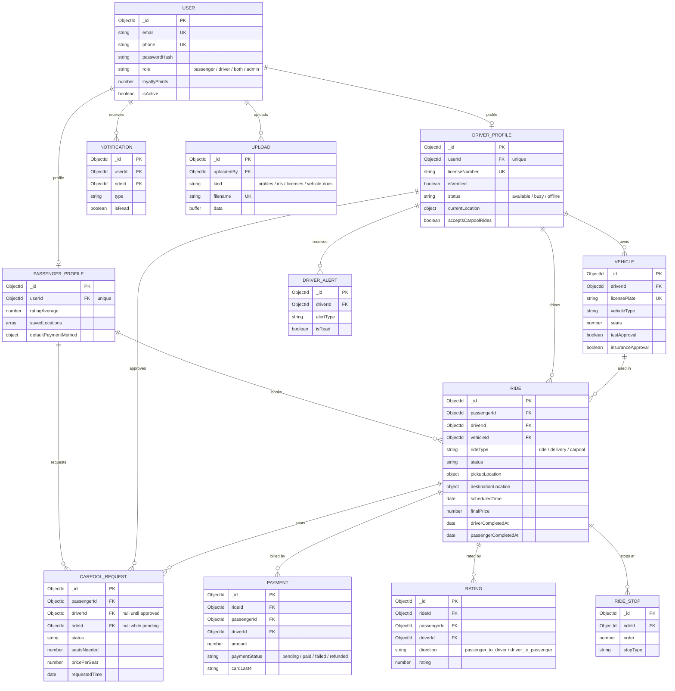

# HailNow

HailNow היא אפליקציית Full Stack להזמנת נסיעות, ניהול נהגים ונוסעים, קרפול, תשלומים מדומים, דירוגים, צ'אט בזמן אמת וניהול אדמין.

## טכנולוגיות מרכזיות

- Frontend: React 18, Vite, React Router, Redux Toolkit, Socket.IO Client, Google Maps.
- Backend: Node.js, Express, Socket.IO, MongoDB, Mongoose, JWT, Google OAuth.
- Database: MongoDB.
- Realtime: Socket.IO, עם אפשרות לחיבור Redis בסביבת ריבוי מופעים.
- Email: Nodemailer או webhook לשליחת איפוס סיסמה.

## מבנה הפרויקט

```text
Full-Stack-Project/
  backend/
    controllers/    לוגיקה עסקית של משתמשים, נסיעות, קרפול, תשלומים, דירוגים ועוד
    db/             חיבור MongoDB ומודלי Mongoose
    middleware/     Authentication, validation, uploads, rate limiting
    routes/         הגדרת נתיבי REST תחת /api
    scripts/        סקריפטים לבדיקות, מיגרציות ויצירת אדמין ראשוני
    tests/          בדיקות יחידה ובדיקות זרימה
    utils/          שירותי עזר: תמחור, Redis, נוכחות נהגים, אימות, מיילים
    app.js          Express app והגדרת middleware
    server.js       HTTP server, Socket.IO ומשימות רקע

  frontend/
    src/api/        הגדרות API ולקוח axios
    src/components/ רכיבים משותפים
    src/context/    Auth context
    src/pages/      מסכי האפליקציה
    src/store/      Redux store
    vite.config.js  הגדרות Vite ו-proxy ל-backend

  start.bat         הרצה נוחה ב-Windows של backend ו-frontend
  stop.bat          עצירת התהליכים שנפתחו דרך start.bat
```

## ארכיטקטורת הקוד בקצרה

ה-frontend הוא SPA ב-React שרץ בפיתוח דרך Vite על `http://localhost:3000`. בקשות API נשלחות לנתיבי `/api`, ובפיתוח Vite מעביר אותן לשרת ה-Express לפי `DEV_BACKEND_TARGET`.

ה-backend הוא שרת Express שמגדיר REST API תחת `/api`, מתחבר ל-MongoDB דרך Mongoose ומנהל הרשאות בעזרת JWT. הנתיבים מחולקים לפי תחומים: משתמשים, נהגים, נוסעים, רכבים, נסיעות, קרפול, תשלומים, דירוגים, התראות והעלאות קבצים.

Socket.IO משמש לעדכוני זמן אמת כמו צ'אט, מיקום נהג, התראות, סטטוס נסיעה ונוכחות נהגים. בסביבת production או בכמה מופעים במקביל ניתן לחבר Redis כדי לשתף אירועי Socket.IO ו-rate limits בין מופעים.

ב-production שרת ה-backend יכול להגיש גם את build הסטטי של React מתוך `frontend/dist`, כך שאפשר להריץ את האפליקציה מתהליך Node אחד אחרי בניית ה-frontend.

## מודל הנתונים

כל הסכמות מוגדרות ב-`backend/db/models/` כסכמות Mongoose, וזהו המקור היחיד לאמת לגבי מבנה הנתונים. הקשרים בין הקולקציות מוצהרים בשדות `ObjectId` עם `ref`, ונטענים בעת הצורך באמצעות `populate`. שמות הקולקציות נגזרים אוטומטית משמות המודלים — ברבים ובאותיות קטנות, כך `User` הופך ל-`users`.

### דיאגרמת קשרים



### הקולקציות

| מודל | קולקציה | תפקיד |
| --- | --- | --- |
| `User` | `users` | זהות והרשאות: שם, אימייל, טלפון, סיסמה מגובבת, תפקיד ונקודות נאמנות. |
| `PassengerProfile` | `passengerprofiles` | נתוני נוסע: דירוג, כתובות שמורות, העדפות ואמצעי תשלום שמור. |
| `DriverProfile` | `driverprofiles` | נתוני נהג: רישיון, אימות, זמינות, מיקום נוכחי ותנאי רכב. |
| `Vehicle` | `vehicles` | רכב של נהג, כולל מספר מושבים ואישורי טסט וביטוח. |
| `Ride` | `rides` | נסיעה: מוצא ויעד, סטטוס, תמחור, העדפות התאמה וזמני סיום. |
| `CarpoolRequest` | `carpoolrequests` | בקשת קרפול: מושבים, תמחור למושב, וקישור לנהג ולנסיעה לאחר אישור. |
| `Payment` | `payments` | תשלום עבור נסיעה. שומר ארבע ספרות אחרונות בלבד, לא מספר כרטיס. |
| `Rating` | `ratings` | דירוג הדדי. `direction` מבחין בין דירוג נוסע לנהג ולהפך. |
| `RideStop` | `ridestops` | עצירות ביניים בנסיעה. |
| `Notification` | `notifications` | התראות למשתמש. |
| `DriverAlert` | `driveralerts` | התראות לנהגים, למשל אזורי ביקוש. |
| `Upload` | `uploads` | קבצי תמונה שהועלו, כולל התוכן הבינארי. ראו סעיף האחסון להלן. |
| `RuntimeLease` | `runtimeleases` | תשתית בלבד: נעילה מבוזרת למשימות רקע. אינו חלק ממודל התחום. |

### שלושה קשרים שחשוב להכיר

**1. משתמש מול פרופילים.** `User` מחזיק זהות בלבד. הנתונים התפעוליים יושבים ב-`PassengerProfile` וב-`DriverProfile`, שלשניהם `userId` ייחודי. משתמש יכול להחזיק את שני הפרופילים במקביל (`role: "both"`), והמערכת יוצרת פרופיל נוסע לכל משתמש — כולל מנהלים.

**2. נסיעת קרפול מחזיקה נוסע ראשי אחד בלבד.** זהו הקשר הפחות מובן מאליו במערכת. ל-`Ride` יש שדה `passengerId` יחיד — הנוסע שעבורו נפתחה הנסיעה. שאר הנוסעים בקרפול מקושרים אליה דרך `CarpoolRequest.rideId`, ולא דרך `Ride`. לכן כל בדיקת הרשאה או סיום נסיעה בקרפול חייבת לבדוק גם את `carpoolrequests`, וכך אכן נעשה ב-`canAccessRide` וב-`completionActorFor` שב-`controllers/rideController.js`.

**3. בקשת קרפול מתחילה בלי נהג ובלי נסיעה.** בעת יצירתה `driverId` ו-`rideId` הם `null`, והיא ממתינה בסטטוס `pending`. שני השדות מתמלאים רק כשנהג מאשר אותה ב-`PUT /carpool/:id/accept`.

### שדות סטטוס

| `Ride.status` | משמעות |
| --- | --- |
| `searching` | נוצרה ומחפשת נהג. |
| `accepted` | נהג שויך, טרם יצא. |
| `driver_arriving` | הנהג בדרך לאיסוף. |
| `in_progress` | הנסיעה בעיצומה. |
| `completed` | הסתיימה — רק לאחר אישור שני הצדדים. |
| `cancelled` | בוטלה על ידי נוסע, נהג או המערכת. |

| `CarpoolRequest.status` | משמעות |
| --- | --- |
| `pending` | ממתינה בתור לאישור נהג. |
| `matched` | נתפסה על ידי נהג, לפני קיבוע הנסיעה. |
| `confirmed` | אושרה ומקושרת לנסיעה. |
| `completed` | הנוסע אישר שהנסיעה הסתיימה. |
| `cancelled` | בוטלה, או פגה לאחר 30 דקות מהמועד המבוקש. |

### אינדקסים

האינדקסים נגזרים מהשאילתות החוזרות, ומוגדרים בתחתית כל קובץ מודל. שלושה ראויים לציון:

- `DriverProfile` — אינדקס משולב `{ status, isVerified, lastActiveAt, geoLocation: "2dsphere" }` המשמש לאיתור נהגים זמינים בקרבת מקום.
- `Rating` — אינדקס ייחודי `{ rideId, direction, passengerId }` המונע דירוג כפול לאותה נסיעה באותו כיוון.
- `Ride` — אינדקסים על `{ passengerId, status }` ו-`{ driverId, status }`, המשמשים את בדיקת "נסיעה פעילה אחת בלבד" ואת לוחות המחוונים.

### אחסון קבצים

בניגוד לדפוס המקובל, קבצים שהועלו אינם נשמרים בדיסק אלא בקולקציה `uploads`, כאשר התוכן עצמו נשמר בשדה `data` מסוג `Buffer`. הסיבה היא שסביבת האירוח היא ephemeral והדיסק נמחק בכל פריסה מחדש. שאר המודלים מחזיקים נתיב לוגי בלבד, למשל `DriverProfile.licenseImagePath` בצורה `/uploads/licenses/<filename>`.

## דרישות מקדימות

- Node.js 18 ומעלה.
- npm.
- MongoDB מקומי או MongoDB Atlas.
- Google OAuth Client ID ו-Google Maps API key להרצה מלאה של מפות והתחברות Google.

## התקנה והרצה מקומית

1. התקנת תלויות backend:

```bash
cd backend
npm install
```

2. התקנת תלויות frontend:

```bash
cd ../frontend
npm install
```

3. יצירת קבצי סביבה:

```bash
copy backend\.env.example backend\.env
copy frontend\.env.example frontend\.env
```

ב-Windows אפשר להריץ משורש הפרויקט:

```bash
start.bat
```

או להריץ ידנית בשני טרמינלים:

```bash
cd backend
npm run dev
```

```bash
cd frontend
npm start
```

ברירת המחדל:

- Frontend: `http://localhost:3000`
- Backend: `http://localhost:5000`
- Health check: `http://localhost:5000/api/health`

## בדיקות

Backend:

```bash
cd backend
npm test
```

Frontend:

```bash
cd frontend
npm test
```

## בנייה ל-production

```bash
cd frontend
npm run build
```

לאחר מכן שרת ה-backend מגיש את הקבצים מתוך `frontend/dist`.

```bash
cd ../backend
npm start
```

## משתני סביבה - Backend

הקובץ המקומי הוא `backend/.env`. אין להעלות אליו סודות אמיתיים ל-Git.

| משתנה | חובה | הסבר |
| --- | --- | --- |
| `PORT` | לא | פורט השרת. ברירת מחדל: `5000`. |
| `DB_CONNECTION` | כן | כתובת החיבור ל-MongoDB, למשל `mongodb://localhost:27017/hailnow`. |
| `JWT_SECRET` | כן | סוד חזק לחתימת JWT. חייב להיות ערך אמיתי וארוך, לא placeholder. |
| `GOOGLE_CLIENT_ID` | כן להרצת Google Login | Google OAuth Client ID שמאושר מול ה-backend. אפשר לשים כמה ערכים מופרדים בפסיקים. |
| `GOOGLE_CLIENT_ID_FILE_FALLBACK` | לא | אם `false`, השרת לא ינסה לקרוא Client ID מתוך קבצי frontend env. |
| `GOOGLE_SERVER_MAPS_API_KEY` | מומלץ | מפתח Google Maps לשרת עבור חישוב מסלול, מרחק, מחיר ו-ETA. |
| `GOOGLE_MAPS_API_KEY` | לא | fallback ישן ל-`GOOGLE_SERVER_MAPS_API_KEY`. |
| `CLIENT_BASE_URL` | כן לאיפוס סיסמה | כתובת ה-frontend לקישורי reset, למשל `http://localhost:3000`. |
| `RETURN_RESET_TOKEN` | לא | בפיתוח בלבד, אם `true` מחזיר reset token בתגובה. לא להשתמש ב-production. |
| `RESET_EMAIL_WEBHOOK_URL` | לא | webhook לשליחת מייל איפוס סיסמה במקום SMTP. |
| `SMTP_HOST` | לא | שרת SMTP לשליחת מיילים. |
| `SMTP_PORT` | לא | פורט SMTP, למשל `587`. |
| `SMTP_SECURE` | לא | האם להשתמש ב-TLS מלא. בדרך כלל `false` עם פורט `587`. |
| `SMTP_USER` | לא | שם משתמש SMTP, ב-Gmail כתובת המייל המלאה. אם מוגדר, חובה להגדיר גם `SMTP_PASS`, אחרת SMTP כבוי לגמרי. |
| `SMTP_PASS` | לא | סיסמת SMTP. ב-Gmail זה App Password בן 16 תווים (לא סיסמת החשבון הרגילה, ונדרש Two-Step Verification). גוגל מציג אותו בארבע קבוצות עם רווחים - אפשר להדביק כך, השרת מסיר את הרווחים. אם מוגדר, חובה להגדיר גם `SMTP_USER`. |
| `MAIL_FROM` | לא | כתובת השולח, למשל `HailNow <no-reply@example.com>`. ב-Gmail חייבת להיות זהה ל-`SMTP_USER`, אחרת גוגל דוחה את השליחה. |
| `SMTP_TIMEOUT_MS` | לא | כמה זמן לחכות לחיבור ולתשובת שרת המייל. ברירת מחדל: `10000`. אם הסביבה חוסמת SMTP יוצא, הבקשה נכשלת מהר עם 503 במקום להיתקע. |
| `CORS_ORIGINS` | מומלץ ב-production | רשימת origins מופרדת בפסיקים שמותרת בדפדפן. |
| `NODE_ENV` | מומלץ ב-production | `production` משנה התנהגות CORS וחלק מהודעות השגיאה. |
| `APP_TIME_ZONE` | לא | אזור זמן לתמחור. ברירת מחדל: `Asia/Jerusalem`. |
| `BOOKING_APPROVAL_GRACE_MS` | לא | זמן המתנה לפני ביטול אוטומטי של נסיעה/בקשת קרפול שלא אושרה. |
| `DRIVER_ACTIVE_WINDOW_MS` | לא | כמה זמן נהג נחשב פעיל לפי heartbeat. |
| `DRIVER_DISCONNECT_GRACE_MS` | לא | זמן חסד לפני שנהג זמין ללא פעילות עובר ל-offline. |
| `SOCKET_RATE_WINDOW_MS` | לא | חלון זמן להגבלת אירועי Socket.IO. |
| `SOCKET_RATE_MAX_EVENTS` | לא | מספר אירועי Socket.IO מותר בחלון. |
| `REDIS_URL` | לא | כתובת Redis כללית, משמשת כ-fallback ל-Socket.IO ול-rate limit. |
| `SOCKET_IO_REDIS_URL` | לא | Redis ייעודי ל-Socket.IO adapter. |
| `REQUIRE_SOCKET_IO_REDIS` | לא | אם `true`, השרת ייכשל בלי Redis ל-Socket.IO. |
| `RATE_LIMIT_STORE` | לא | `memory` או Redis, לפי קונפיגורציית rate limit. |
| `RATE_LIMIT_REDIS_URL` | לא | Redis עבור rate limiting. |
| `RATE_LIMIT_MAX_KEYS` | לא | מגבלת מפתחות לחנות rate limit בזיכרון. |
| `ENABLE_SCHEDULED_TASKS` | לא | הפעלת משימות רקע. ברירת מחדל: `true`. |
| `INSTANCE_ID` | לא | מזהה מופע עבור locks ומשימות רקע בסביבה מרובת מופעים. |
| `GPS_RETENTION_DAYS` | לא | מספר ימים לשמירת מיקומי GPS לפני ניקוי פרטיות. |
| `BOOTSTRAP_ADMIN_EMAIL` | כן לסקריפט bootstrap | אימייל אדמין ראשוני. |
| `BOOTSTRAP_ADMIN_FULL_NAME` | כן לסקריפט bootstrap | שם מלא לאדמין ראשוני. |
| `BOOTSTRAP_ADMIN_PHONE` | כן לסקריפט bootstrap | טלפון לאדמין ראשוני. |
| `BOOTSTRAP_ADMIN_PASSWORD` | כן לסקריפט bootstrap | סיסמה ראשונית חזקה לאדמין. |

## משתני סביבה - Frontend

הקובץ המקומי הוא `frontend/.env`. רק משתנים שמתחילים ב-`VITE_` נחשפים לקוד הדפדפן.

| משתנה | חובה | הסבר |
| --- | --- | --- |
| `VITE_GOOGLE_CLIENT_ID` | כן להרצת Google Login | Google OAuth Client ID בצד הדפדפן. |
| `VITE_GOOGLE_BROWSER_MAPS_API_KEY` | כן למפות | Google Maps API key שמוגבל לשימוש בדפדפן. |
| `VITE_GOOGLE_MAPS_KEY` | לא | fallback ישן למפתח מפות בדפדפן. |
| `VITE_API_URL` | לא | כתובת API. בפיתוח ברירת מחדל: `/api` דרך proxy של Vite. |
| `VITE_SOCKET_URL` | לא | כתובת Socket.IO אם שונה מכתובת ה-API. |
| `VITE_ASSET_ORIGIN` | לא | origin לקבצי assets/uploads אם שונה מכתובת ה-API. |
| `DEV_BACKEND_TARGET` | לא | יעד ה-proxy של Vite בפיתוח. ברירת מחדל: `http://127.0.0.1:5000`. |

## יצירת אדמין ראשוני

לאחר מילוי משתני `BOOTSTRAP_ADMIN_*` ב-`backend/.env`:

```bash
cd backend
npm run bootstrap:admin
```

## סקריפטים שימושיים

Backend:

- `npm run dev` - הרצת שרת עם nodemon.
- `npm start` - הרצת שרת production.
- `npm test` - בדיקות backend.
- `npm run bootstrap:admin` - יצירת/קידום אדמין ראשוני.
- `npm run migrate:rating-direction-index` - מיגרציה לאינדקס דירוגים לפי כיוון ונוסע.
- `npm run privacy:purge-gps` - ניקוי נתוני GPS ישנים.

Frontend:

- `npm start` - הרצת Vite dev server.
- `npm run build` - בניית production.
- `npm test` - בדיקות frontend.

## הערות אבטחה

- לא מעלים קבצי `.env` אמיתיים ל-Git.
- `JWT_SECRET`, מפתחות Google, SMTP ו-Redis צריכים להיות שונים בין פיתוח ל-production.
- ב-production חובה להגדיר `NODE_ENV=production` ו-`CORS_ORIGINS` לערכי ה-domain האמיתיים.
- מפתח Google Maps של הדפדפן צריך להיות מוגבל לפי HTTP referrers.
- מפתח Google Maps של השרת צריך להיות מוגבל לפי API/service ולפי סביבת ההרצה.
